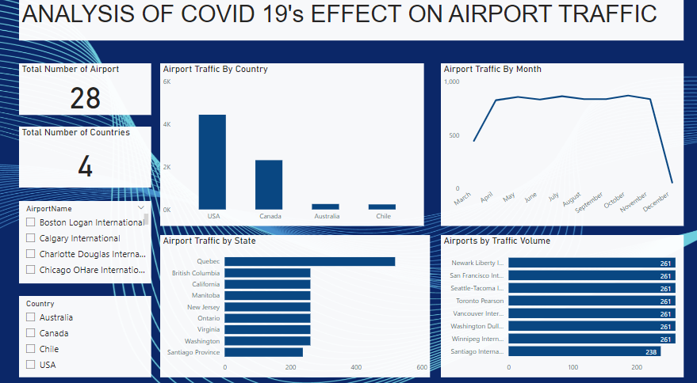

### Analysis of COVID-19's Effect on Airport Traffic

***
## Introduction
The global COVID-19 pandemic brought about unprecedented changes in various aspects of our lives, and one of the sectors significantly impacted was airport traffic. As the world grappled with the challenges of this novel virus, airports became focal points of scrutiny, adaptation, and transformation. In this analysis, we will delve into the profound effects that COVID-19 had on airport traffic.

## Problem Statement

- How did COVID-19 affect airport traffic patterns in different countries?
- What were the monthly variations in airport traffic during the COVID-19 pandemic?
- How did airport traffic vary by state?
- How does the volume of airport traffic vary between different airports?

## Skills

  - Research Skills.
  - Problem Solving.
  - Data Visualization.
  - Critical Thinking.
  - Communication.
  - Adaptability.
  - Time Management.
 
 ## COVID-19 Influence Study

  At this point, I initiate the process of acquainting myself with the data. I gather insights about the dataset, identify areas requiring cleaning, address missing information, assess data organization, and confirm whether we possess the necessary information to address problem statement.

 ## Data Preparation

  - Ensured the data types are consistent.
  - Detect and removed duplicate entries to ensure data integrity.
  - Filtered data from country column that are significantly different from the rest of the dataset.

## Visualization and Analysis

- The United States stands out with the highest traffic at 4,500 followed by Canada with 2,200. In contrast, Austraila and Chile had the lowest traffic volumes.
- October had the highest peak wih 52,000 followed by November at 51,000 and December experieced the lowest at 4,000.
- Quebec takes the top spot with 500, followed by California with 240, British Columbia at 200 and the Santiago province recorded the lowest traffic volume.
- Newark Liberty International, San Francisco International, Seatle Tacoma International, Toronto Pearson International, Vancouver International, Washington Dulles 
  International and Winniepeg International all share a high traffic volume each recording 268. In contrast, Santiago stands out with the lowest traffic volume with 238.

## Recommendation
- Considering the variation in airport traffic patterns due to COVID-19, it's advisable to tailor travel plans based on the current situation in each country. Prioritize destinations with lower traffic volumes, such as Australia and Chile, for potentially safer and less crowded travel experiences. Stay informed about travel restrictions and health guidelines in each location to make well-informed decisions.Prioritize locations with fewer reported cases for a more secure travel experience.
- Given the monthly variations in airport traffic during the COVID-19 pandemic, it's advisable to plan travel during months with lower peaks, like December at 4,000.
- Considering the varying airport traffic by state, if you're planning travel, prioritize destinations with lower traffic volumes like Santiago province for potentially safer and less crowded experiences. Stay informed about specific state-level travel restrictions and health guidelines. Tailor your travel plans based on the COVID-19 situation in each region, prioritizing areas with lower recorded traffic.
- Given the variation in airport traffic, if you're planning travel, consider airports with lower volumes like Santiago for potentially less crowded experiences. Stay updated on specific airport guidelines and COVID-19 measures. Tailor your travel plans based on the traffic situation at each airport, prioritizing those with lower recorded volumes for a potentially smoother and safer journey.
